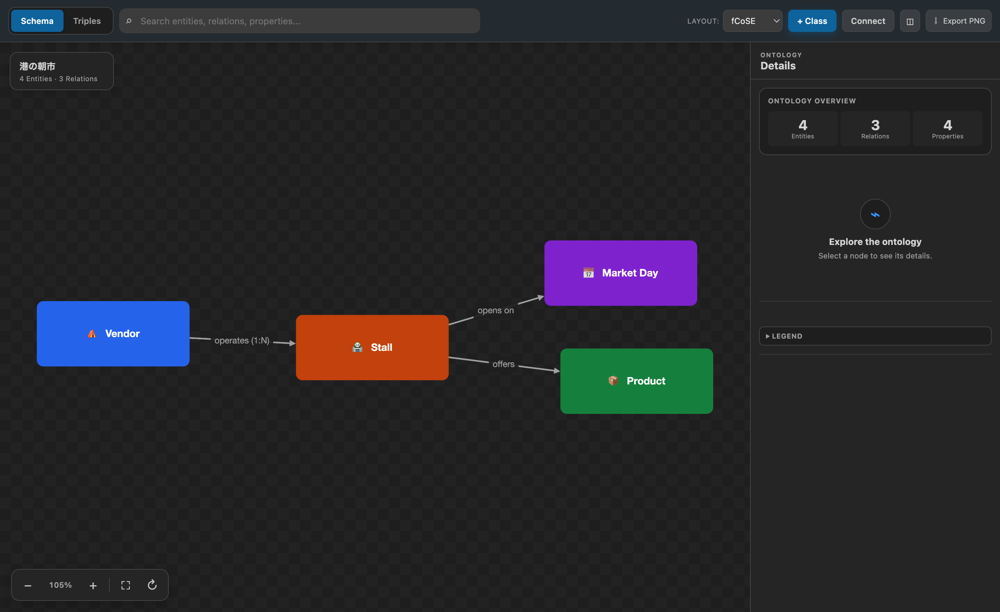

# Ontology Viewer for VS Code

[English](README.md)

OWL、RDF、RDFS、SKOSを、VS Codeから離れずに見やすいスキーマ図で探索できる拡張機能です。検索しやすいキャンバスと安全なTurtle編集を組み合わせ、既存オントロジーの把握にも、考えながら設計する作業にも使えます。

> Ontology Viewerはプレビュー版です。大切なオントロジーではソース管理を有効にし、図から生成された変更をコミット前に確認してください。

## 触ってわかる使いやすさ

- **読みやすいスキーマカード**: データ型プロパティをクラス内にまとめ、トリプルをすべてノードにしたときの視覚的なノイズを抑えます。
- **読みやすく意味のある配色**: 背景に合う文字色を自動選択し、関連するエンティティが同系色になる理由も表示します。
- **広く使えるズーム対応キャンバス**: 拡大・縮小、100%へのリセット、全体表示、レイアウト切替、PNG書き出しを備えています。
- **すばやい移動**: クラス、関係、プロパティを横断検索できます。ノードをダブルクリックすると、周辺だけに集中できます。
- **SPARQLクエリ**: 開いているオントロジーに対して、すべてローカルで SPARQL クエリを実行できます。結果はテキストで表示され、図にも反映されます（一致をハイライト、または一致しないものを絞り込み）。
- **画面幅に合わせたInspector**: 広い画面では図の横に表示し、狭いエディタグループでは閉じられるシートに切り替わります。
- **安全なTurtle書き戻し**: 図からの編集は、生成結果を再パースしてから反映します。クラスや関係の作成、名前変更、プロパティや説明の編集ができます。
- **英語・日本語UI**: VS Codeの表示言語に合わせて切り替わります。
- **ローカル処理**: 拡張機能からオントロジーの内容や利用状況のテレメトリを送信しません。

## 1分ではじめる

1. VS Code Marketplaceから**Ontology Viewer**をインストールします。
2. コマンドパレットから**Ontology Viewer: サンプルオントロジーを作成...**を実行するか、`.ttl`ファイルを開きます。
3. macOSでは`Cmd+Alt+O`、Windows/Linuxでは`Ctrl+Alt+O`を押します。エディタ右上の図ボタンからも開けます。
4. クラスを選択して内容を確認します。キャンバス上のフローティング操作から、拡大・縮小や全体表示を試してください。
5. Turtleファイルでは、Inspectorからクラスを編集し、エディタ側の変更内容を確認します。

詳しい手順は[はじめにガイド](docs/ja/getting-started.md)と[チュートリアル](docs/ja/)にまとめています。

## 主な機能

### 探索する

- クラス中心の**スキーマビュー**と、主語・述語・目的語を表示する**トリプルビュー**を切り替えられます。
- エンティティの検索とフォーカス、入出力関係の確認、エンティティ・関係・プロパティ件数の把握ができます。
- ノードをドラッグして配置できます。同じファイルの図を開き直しても、ビューごとの位置が復元されます。
- 有機的に広がる`fcose`と、階層を追いやすい`dagre`のレイアウトを選べます。
- 現在の図をPNGに、保存済みレイアウトをJSONに書き出せます。

### SPARQLで検索する

ツールバーの **SPARQL** ボタンでパネルを開くと、開いているオントロジーに対して SPARQL 1.1 クエリを実行できます。SELECT・ASK・CONSTRUCT/DESCRIBE に対応しています。**実行**ボタンか `Ctrl`/`Cmd`+`Enter` で実行します。

結果はテキストで表示され（SELECT はバインディングの表、ASK は真偽値、CONSTRUCT は主語・述語・目的語の行）、図にも反映されます。

- **ハイライト**: 一致したノードと接続エッジを強調し、他のグラフはそのまま表示します。
- **絞り込み**: 一致しなかったものを淡色化します。検索ボックスやダブルクリックのフォーカスと組み合わせられます。
- **グラフに反映しない**: テキストの結果のみを表示します。

クエリは拡張機能ホスト内（[Comunica](https://comunica.dev/) を利用）でローカルに実行され、オントロジーの内容が外部に送信されることはありません。

### 安全に編集する

Turtleファイルでは、図からクラスや関係を作成し、エンティティ名、プロパティ、説明を編集できます。変更候補はメモリ上で適用し、再パースに成功した場合だけソースへ反映します。検証に失敗しても、元のファイルは変更されません。

テキスト編集も補助します。Turtleではアウトライン、ホバー、補完、**シンボルの名前変更（F2）**を利用できます。

### 既存のオントロジーを取り込む

RDF/XMLとJSON-LDはそのまま表示できます。図から編集したい場合は、**Ontology Viewer: 編集用にTurtleへ変換...**を実行してください。変換結果は新しい文書として作成し、元ファイルを上書きしません。

## 対応形式

| 形式 | 拡張子 | 図で表示 | 図から編集 |
| --- | --- | :---: | :---: |
| Turtle | `.ttl`, `.turtle` | 対応 | 対応 |
| TriG | `.trig` | 対応 | 非対応 |
| N-Triples | `.nt` | 対応 | 非対応 |
| Notation3 | `.n3` | 対応 | 非対応 |
| RDF/XML / OWL/XML | `.rdf`, `.owl` | 対応 | 変換後に対応 |
| JSON-LD | `.jsonld` | 対応 | 変換後に対応 |

パーサーや編集範囲の詳細は[対応形式](docs/ja/format-support.md)をご覧ください。

## コマンド

| コマンド | 既定のキーバインド |
| --- | --- |
| Ontology Viewer: 図でプレビューを開く | `Cmd+Alt+O` / `Ctrl+Alt+O` |
| Ontology Viewer: 編集用にTurtleへ変換... | — |
| Ontology Viewer: 図のレイアウトをJSONでエクスポート... | — |
| Ontology Viewer: サンプルオントロジーを作成... | — |

`Cmd+Shift+O` / `Ctrl+Shift+O`は、VS Code標準の**エディター内のシンボルへ移動**に割り当てたままです。

## 設定

| 設定項目 | 既定値 | 説明 |
| --- | --- | --- |
| `ontologyViewer.preview.autoRefreshDebounceMs` | `300` | ソース編集後に図を更新するまでの待機時間（ミリ秒）。 |
| `ontologyViewer.preview.defaultView` | `schema` | 最初に開くビュー。`schema`または`triples`。 |
| `ontologyViewer.preview.layout` | `fcose` | 自動レイアウト。`fcose`または`dagre`。 |

## ドキュメントとサポート

- [はじめに](docs/ja/getting-started.md)
- [最初のオントロジーを作る](docs/ja/tutorial-1-first-ontology.md)
- [図から編集する](docs/ja/tutorial-2-editing-from-diagram.md)
- [既存のOWLファイルを取り込む](docs/ja/tutorial-3-importing-owl.md)
- [対応形式](docs/ja/format-support.md)
- [トラブルシューティング](docs/ja/troubleshooting.md)
- [サポート](SUPPORT.ja.md)・[プライバシー](PRIVACY.ja.md)・[セキュリティ](SECURITY.ja.md)
- [コントリビューション](CONTRIBUTING.ja.md)・[変更履歴](CHANGELOG.ja.md)

不具合を報告する前に、[トラブルシューティング](docs/ja/troubleshooting.md)をご確認ください。再現可能な不具合や具体的な機能提案は、[GitHub Issues](https://github.com/yaggytter/vscode-ontology-viewer/issues)で受け付けています。

## プライバシーと信頼性

Ontology Viewerは、VS Codeの拡張機能ホストとWebview内でオントロジーを処理します。テレメトリ、広告、アカウント機能、拡張機能独自のネットワークサービスは含みません。正確なデータの流れは[プライバシーに関する通知](PRIVACY.ja.md)、脆弱性の報告方法は[セキュリティポリシー](SECURITY.ja.md)をご覧ください。

## ライセンス

[MIT License](LICENSE)で公開しています。同梱する依存パッケージの表示は[THIRD_PARTY_NOTICES.md](THIRD_PARTY_NOTICES.md)にまとめています。
